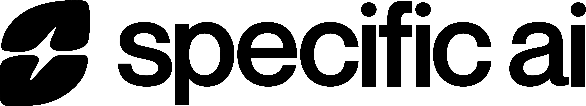

<!--
  DO NOT EDIT in the public repository. This file is generated from
  .devops/docs/customer-facing/public/README.md in SpecificAI's private
  sources by tools/marketplace_mirror/transform_content.py and republished
  on every chart release, so a hand edit here is overwritten by the next
  sync.

  The one hand-managed file in the public repository is
  .github/workflows/pages.yml. Pushing a workflow file requires the sync
  App's `workflows` permission, which the mirror App is not granted — it is
  scoped to repository contents only — so the pipeline deliberately never
  writes under .github/workflows/. Change that file by hand in the public
  repository, and only that file.
-->

<p align="center">
  <picture>
    <source media="(prefers-color-scheme: dark)" srcset="docs/assets/specificai-logo-white.png">
    
  </picture>
</p>

# SpecificAI Platform

<!--
  Static shields.io badges only — no external services beyond img.shields.io.
  The 4.10.2 token is stamped with the released chart
  version by transform_content.py at staging time.
-->
[](https://marketplace-specificai.github.io/specificai-platform/changelog/)
[](https://github.com/orgs/marketplace-specificai/packages/container/package/specificai-platform)
[](LICENSE)
[](https://marketplace-specificai.github.io/specificai-platform/)

Customer-facing documentation and Helm values for deploying the SpecificAI
Platform on your own cloud account.

## Quickstart

The Helm chart is public — pull and install it anonymously, no registry
login:

```bash
helm pull oci://ghcr.io/marketplace-specificai/specificai-platform --version 4.10.2
helm upgrade --install specificai oci://ghcr.io/marketplace-specificai/specificai-platform \
  --version 4.10.2 --namespace specificai --create-namespace --values <your-values-file>.values.yaml
```

Fill in a values file from [`values/`](values/) first — the
[install guide](docs/install.md) walks through every command, including the
image pull credential and upgrades.

This repository is **generated**. A sync bot republishes every file here from
SpecificAI's private sources on each chart release, which is why pull requests
are not accepted: any change merged here would be overwritten by the next
sync. Report issues or request changes through your SpecificAI contact or
`devops@specific.ai`.

## Documentation

Hosted docs: <https://marketplace-specificai.github.io/specificai-platform/>

| Page | Covers |
|---|---|
| [AWS requirements](docs/requirements/aws.md) | Cloud prerequisites for EKS |
| [Azure requirements](docs/requirements/azure.md) | Cloud prerequisites for AKS |
| [GCP requirements](docs/requirements/gcp.md) | Cloud prerequisites for GKE |
| [Registry access](docs/registry-access.md) | The one credential you receive: the Docker token for platform images |
| [Install guide](docs/install.md) | Pull the chart, fill in values, install, verify, upgrade |
| [Upgrade guide](docs/upgrade.md) | Upgrade procedure, per-version pre-upgrade checklist, rollback |
| [Feature availability](docs/features.md) | Features by version and cloud (generated per release) |
| [Support](docs/support.md) | How to reach the SpecificAI team |
| [Changelog](CHANGELOG.md) | Chart versions from 4.0.0 onward |

## Helm chart

The Helm chart is public. It is published to GitHub Container Registry as
[`oci://ghcr.io/marketplace-specificai/specificai-platform`](https://github.com/marketplace-specificai/specificai-platform/pkgs/container/specificai-platform)
and pulls anonymously, with no registry login and no cloud credentials.

The platform's container images are not public. They are stored in
SpecificAI's private Docker registry, and SpecificAI issues you a read-only
Docker token to pull them — the only credential you need. The
[install guide](docs/install.md) shows where it goes.

## Helm values templates

Copy the file that matches your cluster type, replace the `<PLACEHOLDER>`
values, and pass it to `helm upgrade --install` as described in the
[install guide](docs/install.md).

| File | Cluster type |
|---|---|
| [`values/aws-auto-mode.values.yaml`](values/aws-auto-mode.values.yaml) | Amazon EKS Auto Mode |
| [`values/aws-standard.values.yaml`](values/aws-standard.values.yaml) | Amazon EKS with self-managed Karpenter |
| [`values/azure-automatic.values.yaml`](values/azure-automatic.values.yaml) | Azure AKS Automatic |
| [`values/azure-standard.values.yaml`](values/azure-standard.values.yaml) | Azure AKS Standard |
| [`values/gcp-autopilot.values.yaml`](values/gcp-autopilot.values.yaml) | Google GKE Autopilot |
| [`values/gcp-standard.values.yaml`](values/gcp-standard.values.yaml) | Google GKE Standard |

Using the wrong values file for your cluster type can leave GPU workloads
pending — each file's header comments name the exact mode it is for.

## Security

Report suspected vulnerabilities privately to `devops@specific.ai` — see
[SECURITY.md](SECURITY.md).

## License

The Helm values templates under `values/` are licensed under
[Apache-2.0](LICENSE). The documentation under `docs/` is licensed under
[CC BY 4.0](LICENSE-docs).
